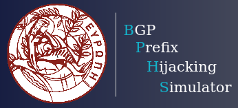

<div id="top"></div>

<!-- PROJECT SHIELDS -->
<!--
*** I'm using markdown "reference style" links for readability.
*** Reference links are enclosed in brackets [ ] instead of parentheses ( ).
*** See the bottom of this document for the declaration of the reference variables
*** for contributors-url, forks-url, etc. This is an optional, concise syntax you may use.
*** https://www.markdownguide.org/basic-syntax/#reference-style-links
-->
[![Contributors][contributors-shield]][contributors-url]
[![Forks][forks-shield]][forks-url]
[![Stargazers][stars-shield]][stars-url]
[![Issues][issues-shield]][issues-url]
[![MIT License][license-shield]][license-url]
[![LinkedIn][linkedin-shield]][linkedin-url]


<!-- PROJECT LOGO -->
<br />
<div align="center">

  <a href="https://github.com/othneildrew/Best-README-Template">
    
  </a>

  <h3 align="center">BPHS</h3>

  <p align="center">
    A BGP Prefix Hijacking Simulation tool supporting RPKI filtering.
    <br />
    <a href="https://github.com/georgeepta/BGP-Simulator"><strong>Explore the docs »</strong></a>
    <br />
    <br />
    <a href="https://github.com/georgeepta/BGP-Simulator">View Demo</a>
    ·
    <a href="https://github.com/georgeepta/BGP-Simulator/issues">Report Bug</a>
    ·
    <a href="https://github.com/georgeepta/BGP-Simulator/issues">Request Feature</a>
  </p>
</div>

<!-- TABLE OF CONTENTS -->
<details>
  <summary>Table of Contents</summary>
  <ol>
    <li>
      <a href="#about-the-project">About The Project</a>
      <ul>
        <li><a href="#built-with">Built With</a></li>
      </ul>
    </li>
    <li><a href="#minimum-system-requirements">Minimum System Requirements</a></li>
    <li><a href="#installation">Installation</a></li>
    <li><a href="#running-bphs">Running BPHS</a></li>
    <li>
      <a href="#using-the-web-application">Using the Web Application</a>
      <ul>
        <li>
          <a href="#new-simulation">New Simulation</a>
          <ul>
            <li><a href="#1-custom-simulation">1. Custom Simulation</a></li>
            <li><a href="#2-random-simulation">2. Random Simulation</a></li>
          </ul>
        </li>
      </ul>
    </li>
  </ol>
</details>


<!-- ABOUT THE PROJECT -->
## About The Project

_BPHS, is a Web-based BGP Prefix Hijacking Simulation tool that enables network operators to quickly and easily:_ 

1. _assess the vulnerability of their Autonomous Systems to BGP prefix hijacks_

2. _measure the benefits of the RPKI’s adoption in the Internet_ 

_through a user-friendly web application._

_With BPHS, the network operators can simulate all the different types of BGP hijacking attacks and obtain the simulation results through an automated and graphical way (i.e., well-designed Graphical User Interface). Also, BPHS can be offered as a Web service to the end-users, meaning that, can be publicly deployed and easily accessible by anyone in the Internet._

BPHS supports:

* user-friendly GUI for easy interaction from desktop and mobile web-browsers 

* multi-threading execution enabling end-users to retrieve quicker results per simulation 

* REST API to allow other applications to communicate with the simulator 

* realtime RPKI filtering using the most up-to-date data from the RPKI databases, for more realistic simulation results

Our simulator, models the Internet graph through the well-known AS relationship datasets from CAIDA, applies the user preferences on the generated graph (e.g., random or custom simulation, hijack type, RPKI filtering mode) and finally simulates the BGP protocol (i.e., BGP route propagation, import-export policies) along with different types of prefix hijacks.


![BPHS Screen Shot][bphs-overview]

<p align="right">(<a href="#top">back to top</a>)</p>


### Built With

BPHS is a full-stack web application that inherits all the characteristics of the MVC model. For its developement we used the following well known frameworks/libraries, databases:

* [React.js](https://reactjs.org/)
* [Flask](https://flask.palletsprojects.com/en/2.1.x/)
* [PostgreSQL](https://www.postgresql.org/)

![BPHS Architecture][bphs-architecture]

<p align="right">(<a href="#top">back to top</a>)</p>


## Minimum Technical Requirements

* CPU: 2 cores
* RAM: 2+ GB (note that needed memory depends on the number of parralel simulations)
* HDD: 500+ MB (depends on the use case for storing the simulation data)
* OS: Ubuntu Linux 18.04+ (other Linux distributions will work too)
* Internet connection (to fetch the latest VRPs using Rootinator)
* Python >= 3.6
* Pip for Python3

<p align="right">(<a href="#top">back to top</a>)</p>


## Installation

1. Clone BPHS repo:
   ```sh
   git clone https://github.com/georgeepta/BGP-Simulator.git
   ```
2. Create a new python virtual environment and install the required python libraries:
   ```sh
   $ cd BGP-Simulator/backend
   $ python3 -m venv venv
   $ source venv/bin/activate
   $ pip3 install -r requirements.txt
   $ deactivate
   ```
3. Install Node.js and npm from NodeSource
   ```sh
   $ curl -sL https://deb.nodesource.com/setup_current.x | sudo -E bash -
   $ sudo apt-get install -y nodejs
   ```
4. Install Docker Engine following the instructions [here](https://docs.docker.com/engine/install/ubuntu/).
5. Install Rootinator (RPKI relying party software) locally using docker ([link to source](https://hub.docker.com/r/nlnetlabs/routinator)):
   ```sh
   $ sudo docker volume create routinator-tals
   $ sudo docker run --rm -v routinator-tals:/home/routinator/.rpki-cache/tals \ nlnetlabs/routinator init -f --accept-arin-rpa
   $ sudo docker run -d --restart=unless-stopped --name routinator -p 3323:3323 \ -p 9556:9556 -v routinator-tals:/home/routinator/.rpki-cache/tals \ nlnetlabs/routinator
   ```
6. Install PostgreSQL following the instructions [here](https://www.postgresql.org/download/linux/ubuntu/). 
7. Create a new Postgres user and do the required configurations:
   ```sh
   $ sudo -u postgres createuser -s your_user
   $ sudo -u postgres -i
   $ ALTER USER your_user PASSWORD 'your_password'
   $ \q
   $ cd /etc/postgresql/13/main/
   $ sudo nano pg_hba.conf (In pg_hba.conf find the line: "local all postgres peer" and replace it with this line: "local all postgres md5". Also add the line "local all your_user md5")
   $ sudo service postgresql restart
   ``` 
8. In ```BGP-Simulator/database/config.json``` edit the ```"db_user_username"``` and ```"db_user_password"``` fields according to your preferences in step 7.
9. Create the BPHS database running the following script:
   ```sh
   $ python3 BGP-Simulator/database/create_db.py
   ```
10. In ```BGP-Simulator/backend/.env``` edit the ```DB_USERNAME``` and ```DB_PASS``` enviroment variables according to your preferences in step 7.


<p align="right">(<a href="#top">back to top</a>)</p>

  
## Running BPHS

1. Start the Flask server:
   ```sh
   $ cd BGP-Simulator/backend/
   $ source venv/bin/activate
   $ flask run
   ```
2. Start the React app:
   ```sh
   $ cd BGP-Simulator/frontend/
   $ npm start
   ```   

<p align="right">(<a href="#top">back to top</a>)</p>


## Using the Web Application

You can access BPHS Web App at:

```sh
http://<React-App_host>/ (e.g., http://localhost:3000/)
```

### New Simulation

```sh
http://<React-App_host>/new-simulation
```
Here you can choose the simulation type:

#### 1. **Custom Simulation**

```sh
http://<React-App_host>/custom-simulation
```

In this simulation type, the user before the simulation’s launch should define his/her preferences for the ASN and CIDR prefix of the victim, hijacker, helper AS(es), and also the number of simulation’s repetitions. If one of the submitted ASNs is not included in simulation topology (i.e., the loaded AS-graph of CAIDA) an error message is returned. We mention that the helper ASes (or anycast ASes as they called) collaborate with the victim AS and help it to mitigate the hijack by announcing a mitigation prefix which should be exact or more specific than hijackers to have a positive effect. In real hijacking scenarios, the traffic attracted by the helper ASes, is redirected to legitimate AS, through a tunneling mechanism. In our simulator, we abstract this process, assuming that the traffic attracted by the helper ASes "virtually" belongs to the victim AS.

For detailed information about the submission form fields read the section 4.2 [here](https://github.com/georgeepta/BGP-Simulator/blob/master/paper/Master_Thesis_Georgios_Eptaminitakis_BPHS.pdf).  

#### 2. **Random Simulation** 

```sh
http://<React-App_host>/random-simulation
```

In this simulation type, contrary to custom simulations, BPHS is responsible to randomly pick the ASN of the victim, hijacker, and helper AS(es) from the AS-graph. Similarly with custom simulations, the user is enabled to launch all the available BGP prefix hijacking attacks. The simulator generates "virtually" prefixes for each attack type; for example, if a user wants to simulate a random sub-prefix hijack then the simulator assumes the prefix "x.y.z.w/24" for the randomly selected victim, and the "x.y.z.w/25" for the randomly selected attacker, helper ASes. In random simulation scenarios, we assume that the victim and helper ASes announce the longest prefix that could partially or fully mitigate the attack. We mention that the random simulation attacks do not support realistic RPKI ROV, due to the "virtually" prefixes that are picked by BPHS. The user is enabled to select the number of random victim-hijacker-helper ASes pairs that BPHS will pick randomly and the simulation repetitions of each selected pair.

For detailed information about the submission form fields read the section 4.2 [here](https://github.com/georgeepta/BGP-Simulator/blob/master/paper/Master_Thesis_Georgios_Eptaminitakis_BPHS.pdf). 


<!-- MARKDOWN LINKS & IMAGES -->
<!-- https://www.markdownguide.org/basic-syntax/#reference-style-links -->
[contributors-shield]: https://img.shields.io/github/contributors/georgeepta/BGP-Simulator.svg?style=for-the-badge
[contributors-url]: https://github.com/georgeepta/BGP-Simulator/graphs/contributors
[forks-shield]: https://img.shields.io/github/forks/georgeepta/BGP-Simulator.svg?style=for-the-badge
[forks-url]: https://github.com/georgeepta/BGP-Simulator/network/members
[stars-shield]: https://img.shields.io/github/stars/georgeepta/BGP-Simulator.svg?style=for-the-badge
[stars-url]: https://github.com/georgeepta/BGP-Simulator/stargazers
[issues-shield]: https://img.shields.io/github/issues/georgeepta/BGP-Simulator.svg?style=for-the-badge
[issues-url]: https://github.com/georgeepta/BGP-Simulator/issues
[license-shield]: https://img.shields.io/github/license/georgeepta/BGP-Simulator.svg?style=for-the-badge
[license-url]: https://github.com/georgeepta/BGP-Simulator/blob/master/LICENSE
[linkedin-shield]: https://img.shields.io/badge/-LinkedIn-black.svg?style=for-the-badge&logo=linkedin&colorB=555
[linkedin-url]: https://www.linkedin.com/in/george-eptaminitakis-5702ab1ba
[bphs-overview]: images/BPHS_overview.png
[bphs-architecture]: images/BPHS_Architecture.png
[gui-home]:images/gui_home.png
[gui-newsim.png]:images/gui_newsim.png
[gui-customsim.png]:images/gui_customsim.png
[gui-randomsim.png]:images/gui_randomsim.png
